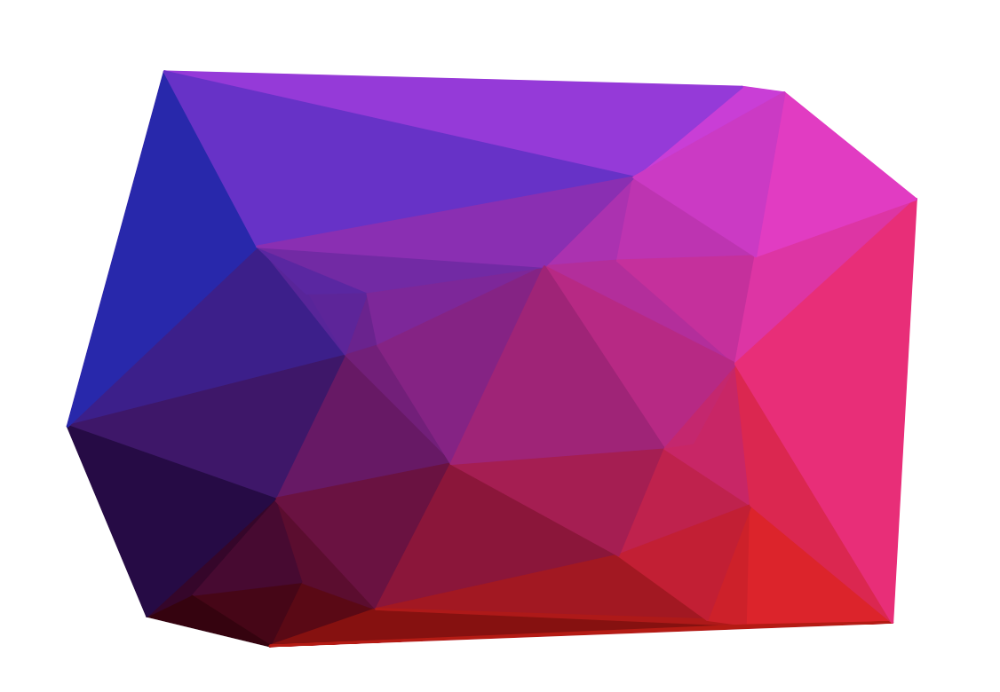

# Traingulation

Have you ever seen one of those pictures which is made up of block colour triangles and thought that would be fun to code. Well welcome to my world.

This is a small project to explore how we could code it up in a simple way and then maybe try and do something cool with it.

## Run it
First you need to set up the environment and install the requirements.
``` sh
python -m venv venv
source venv/bin/activate
pip install -r requirements.txt
```

Then you should be good to go.
``` sh
python app.py
```

### Help
``` sh
python app.py -h        
usage: Triangulation [-h] [-p POINTS] [-e EDGE_POINTS] [-r RANDOM_SEED]
                     [-lc LEFT_COLOUR [LEFT_COLOUR ...]]
                     [-rc RIGHT_COLOUR [RIGHT_COLOUR ...]]
                     [-bc BOTTOM_COLOUR [BOTTOM_COLOUR ...]]
                     [-tc TOP_COLOUR [TOP_COLOUR ...]]

Make pretty triangles

optional arguments:
  -h, --help            show this help message and exit
  -p POINTS, --points POINTS
                        The number of points for to be created (default=50)
  -e EDGE_POINTS, --edge-points EDGE_POINTS
                        The proportion of points located on the edge
                        (default=0.2)
  -r RANDOM_SEED, --random-seed RANDOM_SEED
                        The random seed to be used
  -lc LEFT_COLOUR [LEFT_COLOUR ...], --left-colour LEFT_COLOUR [LEFT_COLOUR ...]
                        The colour associated with the left hand side
                        (default=white)
  -rc RIGHT_COLOUR [RIGHT_COLOUR ...], --right-colour RIGHT_COLOUR [RIGHT_COLOUR ...]
                        The colour associated with the right hand side
                        (default=red)
  -bc BOTTOM_COLOUR [BOTTOM_COLOUR ...], --bottom-colour BOTTOM_COLOUR [BOTTOM_COLOUR ...]
                        The colour associated with the bottom (default=white)
  -tc TOP_COLOUR [TOP_COLOUR ...], --top-colour TOP_COLOUR [TOP_COLOUR ...]
                        The colour associated with the top (default=red)
```