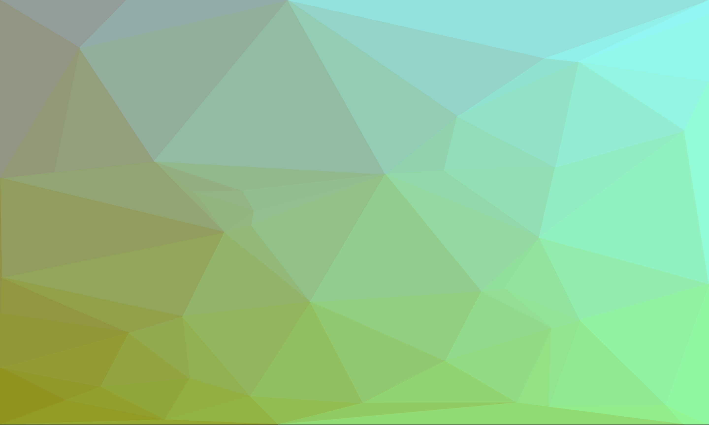

# Traingulation

Have you ever seen one of those pictures which is made up of block colour triangles and thought that would be fun to code. Well welcome to my world.

This is a small project to explore how we could code it up in a simple way and then maybe try and do something cool with it.

## Run it
First you need to set up the environment and install the requirements.
``` sh
python -m venv venv
source venv/bin/activate
pip install -r requirements.txt
```

Then you should be good to go.
``` sh
python app.py
```